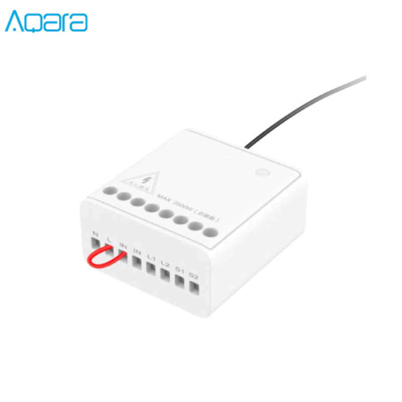
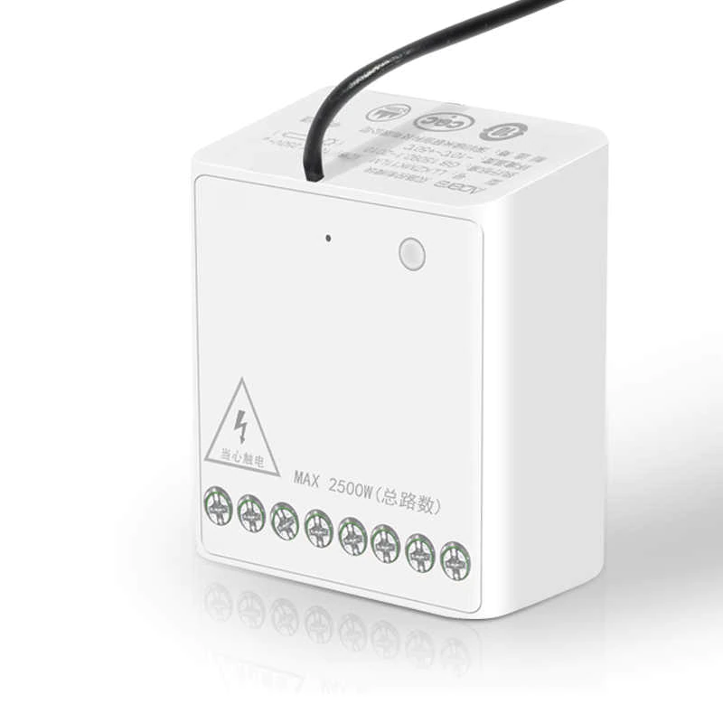
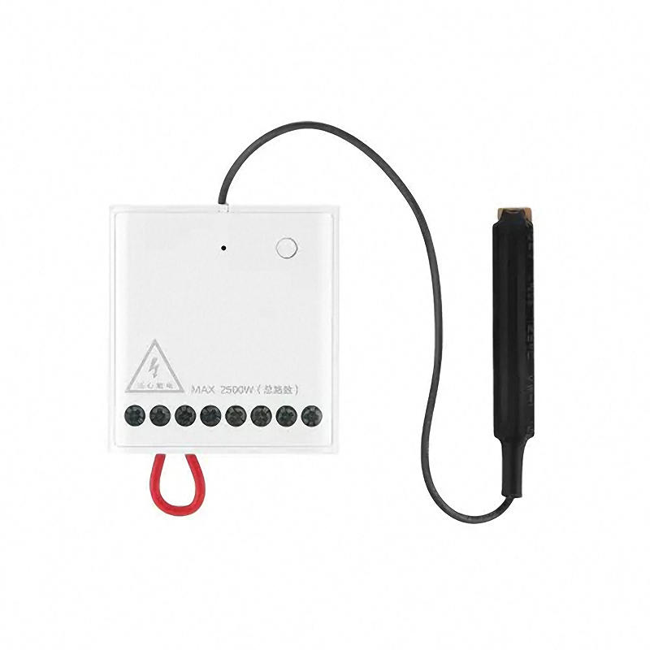
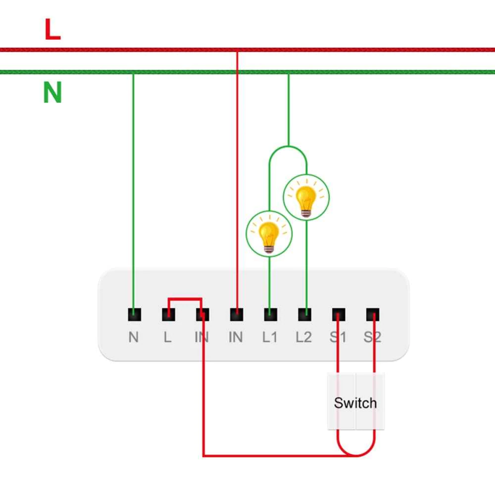
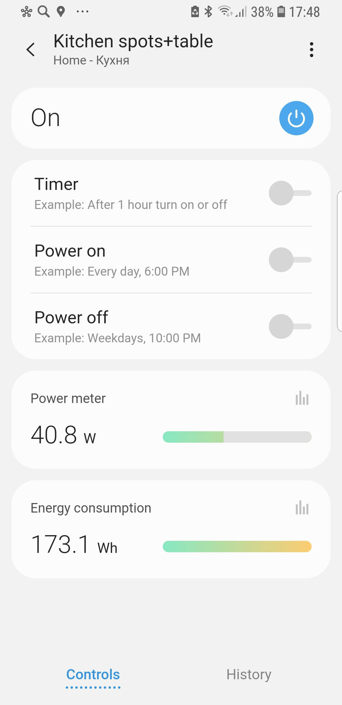
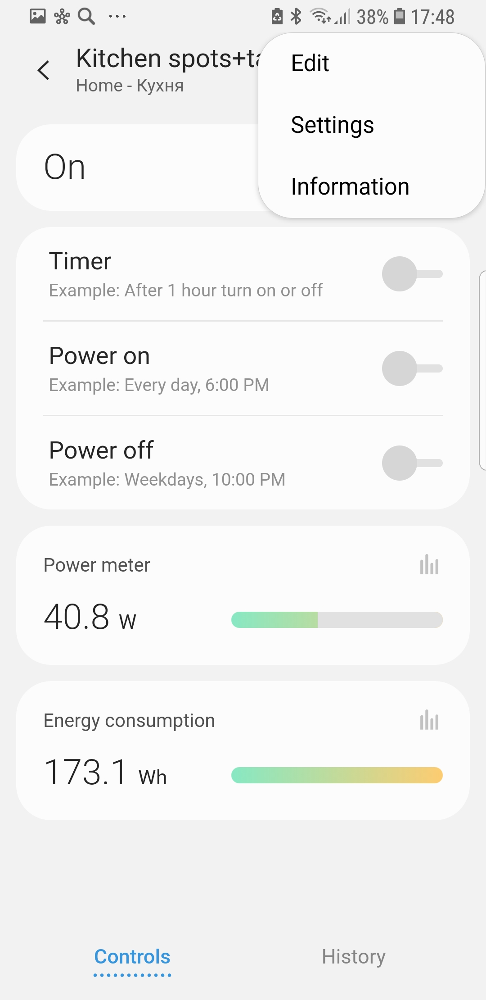
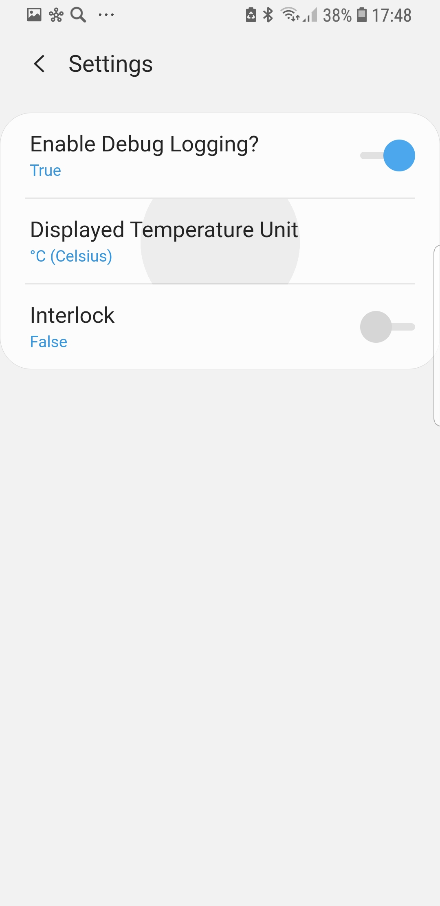
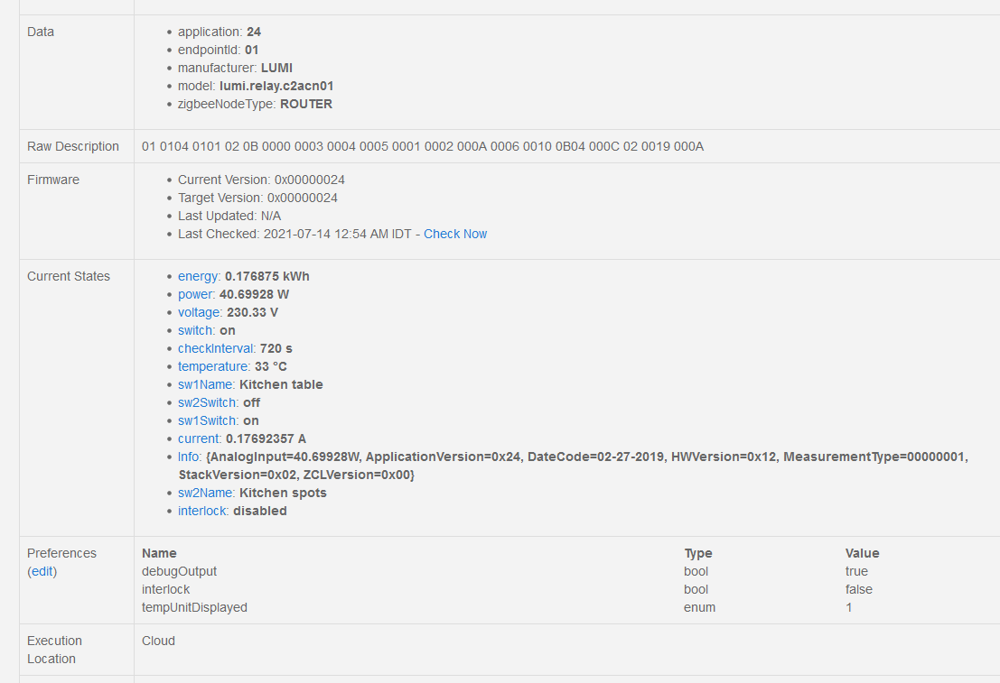

# Smartthings device handlers

## [Aqara Two-way Zigbee Relay (LLKZMK11LM)](aqara/)

|   |  |  |
|---|--|--|
|{width=50%} | {width=50%} |  |
| {width=50%} | |

### Specs

|                       |                           |
|-----------------------|---------------------------|
| Input Voltage         | 100-250V / 50Hz           |
| Maximum Load          | 10A/2500W (total)         |
| Size                  | 49.3 x 46 x 24mm          |
| Connection Protocol   | Zigbee 3.0 / IEEE 802.15.4|
| Wireless Frequency    | 2.4GHz (2400～2483.5MHz)   |
| Weight                | 50g                       |
| Operating Temperature | 5%~95%RH                  |
| Control channels      | 2 *Max load 10A total*    |
| Additional features   | *Requires Neutral wire*   |
|                       | Temperature measurement   |
|                       | Voltage measurement (on control line)              |
|                       | Power measurement (cumulative for both channels)   |
|                       | Enery measurement (cumulative for both channels)   |
|                       | Current measurement (cumulative for both channels) |
|                       | Interlock |

### Compatibility
 |  Hub                                   | Compatible                                     | Amazon Alexa | Google Assistant | Yandex Alisa |
 |----------------------------------------|------------------------------------------------|--------------|------------------|--------------|
 | Aeotec Smart Home Hub V3 (SmartThings) | Requires installation of custom device handler | Yes          | No data          | Not supported|
 | Aqara Hub                              | Yes                                            |              |                  |              |
 | Amazon Echo (4th gen)                  | No data                                        |              |                  |              |
 

---

### Pairing Instructions for Smartthings
1. Install Custom Device handler  (this needs to be done only once)

* Log Into The SmartThings IDE ( https://graph.api.smartthings.com/ )  
* Click On My Device Handlers
* Click On Create New Device Handler. Choose the option “From code“ and copy and paste the code. Press "Create"
* Click "Save" and "Publish->For Me" 

2. Connect the Relay. The blue led should start blinking
3. Put your Zigbee hub into pairing mode
4. Press and hold the button on the realay for about 5-8 seconds, until the blue light starts blinking faster. Release the button. The pairing should begin
5. The correct device handler should be selected automatically and 3 devices should appear

### Device handler from this repo

The device handler will create 3 "Things" for Aqara module

1. Main device that will switch on or off both channels
2. Two Child devices that allow to control (switch on/off) a particular relay/channel

** Device handler support **

1. Power measurement (cumulative for both channels) in Main device in Smartthings app and IDE
2. Energy consumption (cumulative for both channels) in Main device and IDE
3. Temperature measurement ( only in IDE )
4. Choosing temperature units ( Celsius or Fahrenheit ). This is available in the Settings of the Main device
4. Voltage ( only in IDE )
5. Current ( only in IDE )
6. Interlock ( read only in IDE, configurable in Main device settings )
7. Additional info 
* Application Info
* Date Code
* HW Version
* Stack version
* ZCL Version

** Smartthings views **

|   Main device view  | Main device view with settings         | Main device view with settings |
|---------------------|----------------------------------------|--------------------------------|
| {width=50%}| {width=50%} | {width=50%} | 

** IDE view **

|                                                                                           |
|-------------------------------------------------------------------------------------------|
| {width=50%}|

### Technical info

** Zigbee join **

    zbjoin: {"dni":"64AB","d":"00158D0006D4F038","capabilities":"8E",
        "endpoints":[{"simple":"01 0104 0101 02 0B 0000 0003 0004 0005 0001 0002 000A 0006 0010 0B04 000C 02 0019 000A","application":"24","manufacturer":"LUMI","model":"lumi.relay.c2acn01"},
	                 {"simple":"02 0104 0101 02 04 0006 0010 0004 0005 00","application":"","manufacturer":"","model":""}],"parent":"0000","joinType":1,"joinDurationMs":689,"joinAttempts":1}

** Catchall **

*Basic cluster, ClusterID 0x0000, Attribute 0xFF01*

|Pos   |Attribute | Data Type | Len |Description                    |
|------|----------|-----------|-----|-------------------------------|
|0-3   |          |           |     |                               |     	           	     	             
|4-6   |0x03      | 0x28      |	1   | Temperature                   |
|7-10  | 0x05     | 0x21      |	2   |	                            |
|11-20 | 0x07     | 0x27      |	8   |	                            |
|21-24 | 0x08     | 0x21      |	2   | Always [24, 12] - 4644        |
|25-28 | 0x09     | 0x21      |	2   |	                            |
|29-31 | 0x64     | 0x10      |	1   | switch 1 status 00-off, 01-on |
|32-34 | 0x65     | 0x10      |	1   | switch 2 status               |
|35-37 | 0x6E     | 0x20      |	1   |	                            |
|38-40 | 0x6F     | 0x20      |	1   |	                            |
|41-43 | 0x94     | 0x20      |	1   |	                            |
|44-49 | 0x95     | 0x39      |	4   | energy                        |
|50-55 | 0x96     | 0x39      |	4   | voltage multiplied by 10      |
|56-61 | 0x97     | 0x39      |	4   | current                       |
|62-67 | 0x98     | 0x39      |	4   | power                         |
|68-71 | 0x9B     | 0x21      |	2   |	                            |

*On/Off (Switch) cluster, ClusterID 0x0006*

Attribute is not set

Reported switch state per endpoint. Endpoint 1 for channel 1, EP 2 for channel 2 

The first byte of data contains the switch state 00 - off, 01 - on

*Binary Output, ClusterID 0x0010*

Interlock modification completion code 

** Atributes **

| Cluster | Attribute | Description                         | Comments     |
|---------|-----------|-------------------------------------|--------------|
| 0x0000  | 0x0000    | ZCLVersion                          |              |
|         | 0x0001    | Application Version                 |              |
|         | 0x0002    | Stack Version                       |              |
|         | 0x0003    | HW Version                          |              |
|         | 0x0006    | Date Code                           | Hex string   |
| 0x0001  | 0x0000    | Voltage (EP=1)                      | Not reported |
| 0x0002  | 0x0000    | Temperature                         |              |
| 0x0006  | 0x0000    | On/Off state for given  EP          |              |
| 0x000C  | 0x0055    | Power (float 4 bytes)               |              |
| 0x0010  | 0xFF06    | Interlock                           |              |
| 0x0B04  | 0x0000    | Electrical Measurement - Basic info |              |

## SmartHome4U Multi Smart ZIGBEE Module SH4U.101.110 (TS0601)

### Specs

|                       |                           |
|-----------------------|---------------------------|
| Input Voltage         | 240V / 50Hz               |
| Maximum Load          | 2x600W                    |
| Size                  | 40 x 40 x 20 mm           |
| Connection Protocol   | |
| Wireless Frequency    |    |
| Weight                |                        |
| Operating Temperature |                  |
| Control channels      | 2 *Max load 600W per channel * |
| Additional features   | *Requires Neutral wire*   |
|                       | Either 2 channel Switch or Roller Shutter |

### Compatibility
 |  Hub                                   | Compatible                                     | Amazon Alexa | Google Assistant | Yandex Alisa |
 |----------------------------------------|------------------------------------------------|--------------|------------------|--------------|
